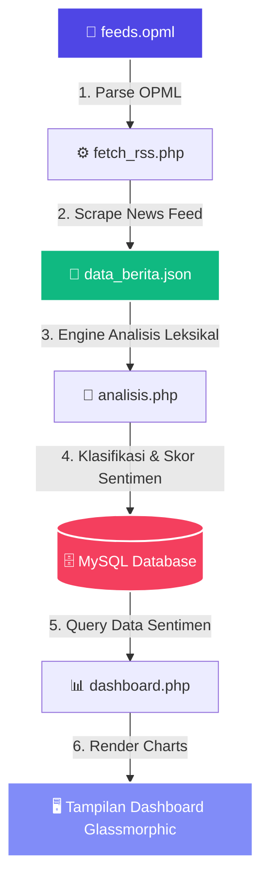

# 🌟 SENTIMENT ANALITIK — Platform Analisis Sentimen Berita Modern

<p align="center">
  
  
  
  
  
</p>

---

## 🚀 Sekilas Tentang Project

**Sentiment Analitik** adalah platform berbasis web mutakhir yang dirancang untuk mengikis (scraping), memproses, dan memvisualisasikan sentimen dari berbagai sumber berita (RSS Feed) secara *real-time*. Dengan menggabungkan mesin analisis sentimen berbasis leksikon (*dictionary-based*) yang efisien serta visualisasi UI **Glassmorphism** futuristik, platform ini memungkinkan Anda melihat tren emosional publik dalam hitungan detik.

> 💡 **Teknologi Utama**: Didukung oleh PHP murni berkinerja tinggi, database relasional MySQL, dan visualisasi interaktif dinamis menggunakan Chart.js.

---

## 🎨 Tampilan UI Futuristik (Glassmorphic Glow)

Sistem ini didesain dengan konsep **Cyberpunk Glassmorphism** yang memanjakan mata:
*   🌌 **Latar Belakang Gelap Dinamis** dengan gradasi cahaya radial neon (*purple-rose glow*).
*   🔮 **Efek Kaca Buram (Backdrop Blur)** yang memberikan kesan premium, modern, dan transparan.
*   ⚡ **Animasi Mikro** pada tombol, kartu, dan formulir untuk interaksi yang mulus.

---

## 🛠️ Fitur-Fitur Utama

Platform ini dilengkapi dengan serangkaian fitur tingkat tinggi:

| Fitur | Deskripsi | Status |
| :--- | :--- | :---: |
| 📡 **RSS Feed Ingestor** | Membaca feed berita massal secara otomatis dari file konfigurasi `feeds.opml`. | ✔️ Active |
| 🧠 **Sentiment Classifier** | Mesin analisis sentimen leksikal yang membagi sentimen menjadi **Positif**, **Negatif**, atau **Netral**. | ✔️ Active |
| 📊 **Interactive Dashboard** | Visualisasi diagram sentimen menggunakan **Chart.js** yang diperbarui secara instan. | ✔️ Active |
| ✍️ **Manual Input Testing** | Formulir khusus untuk melakukan uji coba analisis teks buatan sendiri secara langsung. | ✔️ Active |
| 🔌 **API Integration** | Endpoint JSON (`api_hasil.php`) siap pakai untuk integrasi ke sistem eksternal. | ✔️ Active |

---

## 📐 Arsitektur Aliran Data (Data Flow)

Berikut adalah diagram alir data bagaimana sistem mengolah berita mentah menjadi visualisasi sentimen:



---

## ⚙️ Cara Instalasi & Penggunaan

Ikuti langkah-langkah mudah berikut untuk menjalankan platform ini di server lokal Anda:

### 1. Prasyarat (Prerequisites)
Pastikan Anda memiliki tumpukan server lokal berikut yang sudah aktif:
*   **PHP** >= 7.4 (Ekstensi `curl` & `simplexml` harus aktif)
*   **MySQL** / **MariaDB**
*   Server Web (**Apache** / **Nginx**) atau jalankan PHP CLI server.

### 2. Kloning Repositori
```bash
git clone https://github.com/BaridNst/Sentiment-Analysis.git
cd Sentiment-Analysis
```

### 3. Konfigurasi Database
Buka file [`koneksi.php`](file:///c:/sentiment-analysis/koneksi.php) dan sesuaikan kredensial database Anda:
```php
$host = "localhost";
$user = "root";
$pass = "password_anda"; // Isi password MySQL Anda
$db   = "db_sentiment_analysis";
```
> ℹ️ **Catatan**: Sistem ini dilengkapi fitur *auto-install*. Saat Anda pertama kali mengakses web, sistem akan secara otomatis membuat database `db_sentiment_analysis` beserta tabel `berita` jika belum ada.

### 4. Tarik Berita Terbaru (Scraping)
Jalankan script penarik RSS feed untuk mengisi data berita lokal:
*   Melalui Browser: Akses `http://localhost/sentiment-analysis/fetch_rss.php`
*   Melalui Command Line (CLI):
    ```bash
    php fetch_rss.php
    ```

### 5. Jalankan Proses Analisis Sentimen
Untuk menganalisis berita yang sudah di-scrape ke dalam database MySQL:
*   Akses `http://localhost/sentiment-analysis/analisis.php` pada browser Anda.

### 6. Buka Dashboard Utama
Akses dashboard utama untuk melihat visualisasi dan grafik analisis:
*   Akses `http://localhost/sentiment-analysis/dashboard.php`

---

## 🧬 Struktur Berkas Project

```text
├── index.php             # Halaman visualisasi JSON eksternal
├── dashboard.php         # Dashboard utama (Statistik, Chart, & Input Manual)
├── analisis.php          # Engine utama klasifikasi sentimen
├── fetch_rss.php         # Scraper berita dari RSS Feed OPML
├── api_hasil.php         # API output sentimen berformat JSON
├── koneksi.php           # Konektor database MySQL & Auto-DDL
├── feeds.opml            # Daftar link RSS Feed target
├── data_berita.json      # Cache berita hasil scrap mentah
└── README.md             # Dokumentasi project
```

---

## 🤝 Kontribusi

Kontribusi selalu terbuka lebar! Jika Anda memiliki ide cemerlang untuk meningkatkan algoritma sentimen atau memperindah visualisasi dashboard:

1. Fork Repositori ini.
2. Buat branch fitur baru (`git checkout -b fitur/KerenBanget`).
3. Commit perubahan Anda (`git commit -m 'Menambahkan fitur keren'`).
4. Push ke branch tersebut (`git push origin fitur/KerenBanget`).
5. Buat Pull Request.

---

<p align="center">
  Dibuat dengan ❤️ oleh <a href="https://github.com/BaridNst">Barid Nasution</a>
</p>